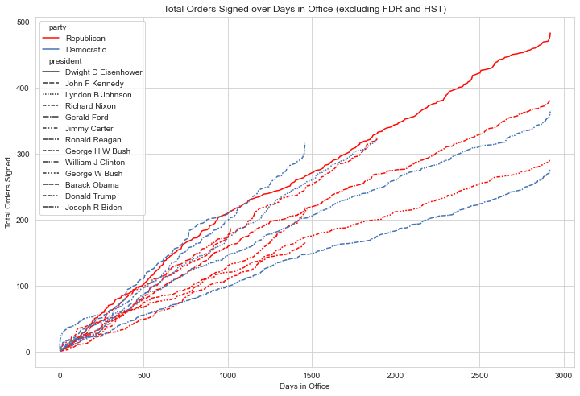

# Executive Orders - Part 1

What are executive orders? Good question.

***I'll tell you later***

I noticed a tendency to criticize sitting presidents for the amount of executive orders they signed, things like "The current president has signed more executive orders than any other president". This seemed easy enough to investigate, so I did. I pulled my data from the [Federal Register](https://www.archives.gov/federal-register/executive-orders/disposition) (note: this only has exact dates starting in 1937 - partway through FDR's presidency).

To start, let's look at the total number of orders signed over the number of days in office.

FDR wins, case closed. We can all go home.

...Okay, fine, let's call FDR an outlier (which he clearly is) and try this graph again *without* him.

You know, as much as I enjoy a good line plot, I think there's a better way to investigate this data. Why don't we compare the average orders signed per year by each president? (preemptively excluding FDR, *we've seen what he does to graphs*)

Better. And still fairly easy to prove the claim wrong (though Biden is certainly up there). However, I've usually heard this claim made about relatively new presidents, so we'll cut it down to how many orders each signed in their first 100 days.

Okay, so: if we *also* ignore Harry Truman, and only compare the *first 100 days in office*, this seems to be a fair claim to make about Donald Trump and Joe Biden. 

But focusing on the start of the term does raise the question: how many of those orders were just to undo the work of their predecessor? I'll dig into this in part two.

***

Bonus graphs!

