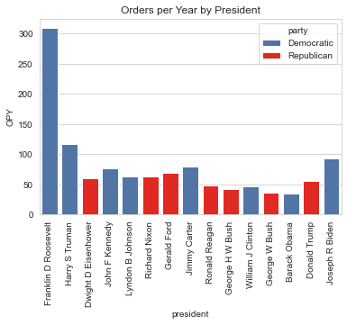
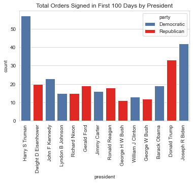
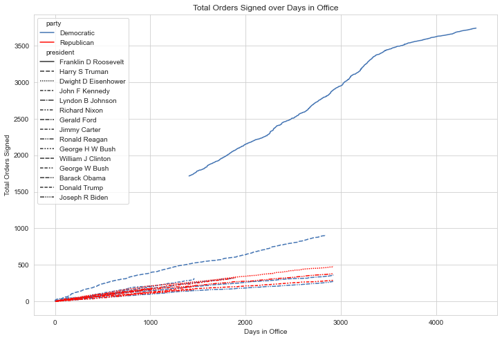

# Executive Orders - Part 1

What are executive orders? Good question.

***I'll tell you later***

I noticed a tendency to criticize sitting presidents for the amount of executive orders they signed, things like "The current president has signed more executive orders than any other president". This seemed easy enough to investigate, so I did. I started off with a simple analysis comparing orders signed per year in office, to fairly compare one-term and two-term presidents.

The data I used for this only went as far back as 1937 (partway through FDR's presidency), but that's enough to show that anyone making these claims about the last few presidents is demonstrably wrong. But FDR does make it difficult to compare the rest, so lets take him off the graph and amend the claim to: "The current president has signed more executive orders than any other president *since FDR*".

Better. And still fairly easy to prove the claim wrong (though Biden is now in 2nd). However, I've usually heard this claim made about relatively new presidents, so we'll cut it down to how many orders each signed in their first 100 days.

Okay, so if we *also* ignore Harry Truman, this seems to be a fair claim to make about Donald Trump and Joe Biden. 

